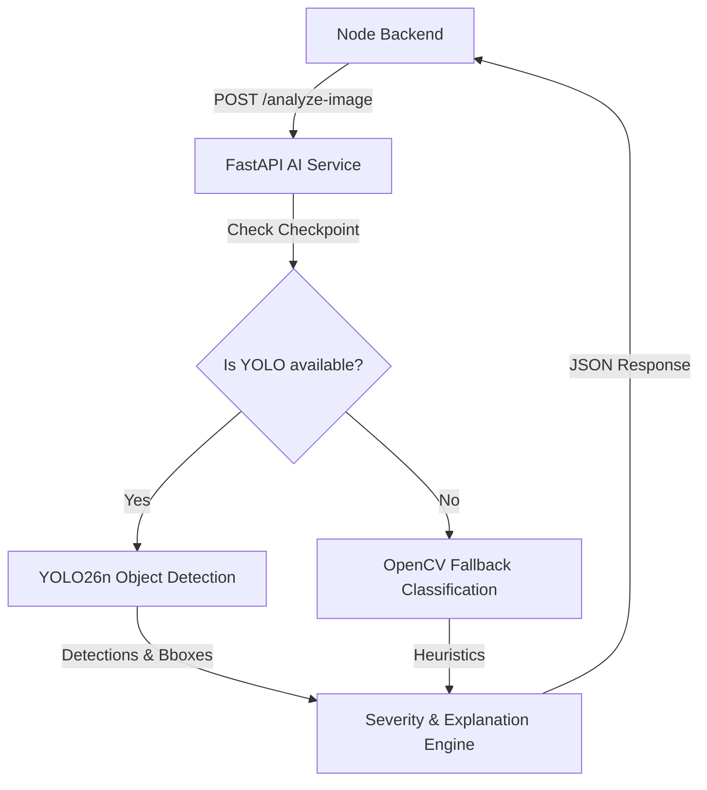

# Implementation Plan: YOLO Object Detection Integration

This plan describes the architecture and steps to integrate a custom-trained **Ultralytics YOLO26n** object-detection model as the primary civic issue classifier in the NAGAR-X AI service. The existing classical CV metrics (contour analysis, edge density, and HSV saturation) and verification logic will be retained as supporting analyzers and fallbacks.

---

## 1. User Review Required

> [!IMPORTANT]
> **Model Loading and Fallback**: The FastAPI service will attempt to load the YOLO checkpoint (`yolo26n.pt` or a custom path via `.env`) at startup. If the checkpoint is missing or compilation/hardware issues arise, it will log a warning and fall back to the classical CV rule-based classification. This ensures that developer setups without the local trained checkpoint remain fully operational.
>
> **Confidence Threshold**: We will establish a configurable confidence threshold (e.g. `0.45` by default) in the FastAPI configuration. Detections below this threshold will be classified as `UNKNOWN` or flagged for manual review rather than being forced into a mismatch.

---

## 2. Proposed Architecture

We will implement a unified intake flow in the Python AI Service. The YOLO model will locate objects (garbage, potholes, etc.) and calculate their relative visual sizes, while the business-rule severity engine combines this with text urgency and classical CV metrics.

### File Actions

#### [NEW] [ai-service/app/models/civic_detector.py](file:///c:/Users/bhavi/OneDrive/Desktop/SIH/SIH-2026/ai-service/app/models/civic_detector.py)
This module will manage the YOLO model lifecycle:
- Load the Ultralytics YOLO model once at startup.
- Handle fallback gracefully if `yolo26n.pt` is missing or fails to load.
- Run inference and parse results into structured Python dictionaries with coordinates, labels, and confidences.

#### [MODIFY] [ai-service/app/main.py](file:///c:/Users/bhavi/OneDrive/Desktop/SIH/SIH-2026/ai-service/app/main.py)
- Import `civic_detector` and instantiate it on app startup.
- Expose both `POST /analyze-image` and `POST /ai/analyze-image` endpoints.
- Extract file bytes and call the combined classification logic.

#### [MODIFY] [ai-service/app/vision.py](file:///c:/Users/bhavi/OneDrive/Desktop/SIH/SIH-2026/ai-service/app/vision.py)
- Refactor `analyze_image_cv` to accept the YOLO model detections.
- If YOLO detections exist, map the highest-confidence detection to the primary category.
- Calculate **Severity Score** based on:
  - Bounding box area relative to image size.
  - Number of detected objects (e.g., multiple potholes/garbage piles increase severity).
  - Text description triggers.
- If YOLO detections do not exist, fall back to the classical CV logic.

#### [NEW] [scripts/train_yolo.py](file:///c:/Users/bhavi/OneDrive/Desktop/SIH/SIH-2026/scripts/train_yolo.py)
- A reproducible script to fine-tune the YOLO model from a pretrained checkpoint using configurations.

#### [NEW] [scripts/validate_yolo.py](file:///c:/Users/bhavi/OneDrive/Desktop/SIH/SIH-2026/scripts/validate_yolo.py)
- Evaluate model metrics ($mAP@50$, precision, recall) on the test/val split.

#### [NEW] [scripts/predict_yolo.py](file:///c:/Users/bhavi/OneDrive/Desktop/SIH/SIH-2026/scripts/predict_yolo.py)
- Script to run standalone image predictions.

#### [NEW] [datasets/nagarx/data.yaml](file:///c:/Users/bhavi/OneDrive/Desktop/SIH/SIH-2026/datasets/nagarx/data.yaml)
- Configure paths to training, validation, and test datasets, and register our 6 classes: `garbage`, `pothole`, `water_leakage`, `damaged_streetlight`, `overflowing_drain`, `fallen_tree`.

---

## 3. Verification Plan

### Automated Verification
- Create a test file `ai-service/tests/test_ai_endpoints.py` to check:
  - `/analyze-image` endpoint with valid mock inputs.
  - Verification of fallback behaviour when model is mocked or set to `None`.
  - Severity scoring accuracy and bounding box percentage computations.

### Manual Verification
1. Run `scripts/predict_yolo.py` on a dummy image to verify model loading.
2. Query `POST /analyze-image` using Postman/cURL with a test image and verify the JSON shape matches the specification:
   - Check if `category`, `confidence`, `detections`, `severity`, and `explanation` are populated correctly.
